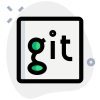

## Hi there, i'm Andrew 

I'm junior python developer, street photographer, ex Sony's salesman and just handsome.

 

### Languages and Tools 

  
  
  
  
  

 

### Connect with me 

  
  
  
  
  

 

### Listen to music with me and program your project

<!------>

Discover something new for yourself 

 
 

 

  <!--- 

    
  
 --->
  

    
  

